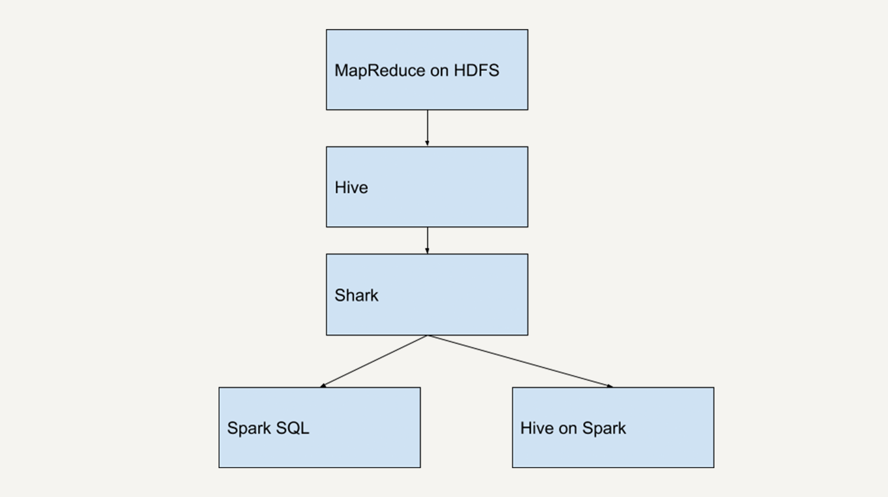
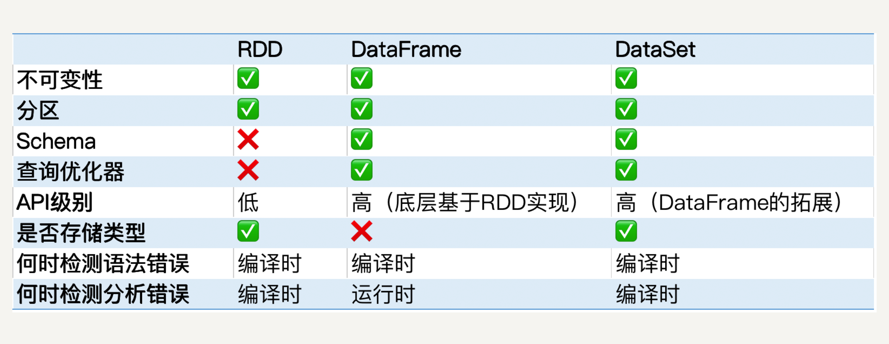

---

title: SparkSQL之基本概念

categories:

- SparkSQL

tags:

---
# 发展历史

由于MapReduce对于开发者而言使用难度较大，大部分开发人员最熟悉的还是传统的关系型数据库,为了方便开发人员使用Hadoop,Hive应运而生

Hive提供了类似SQL的编程接口,Hive QL(HQL)语句经过语法解析、逻辑计划、物理计划转化成MapReduce程序执行，使得开发人员可以很容易的对HDFS上存储的数据进行查询和分析.

Spark在刚问世的时候,Spark团队也开发了一个Shark来支持SQL语言来查询Spark的数据.而Shark，它的本质就是Hive，Shark只是修改了Hive的内存管理模块，大幅优化了运行速度. 但是Shark 对于 Hive的依赖严重影响了Spark的发展,Spark想要定义的是一个统一的技术栈和完整的生态,所以不允许有这样的外在依赖.




如果Spark想发布新的功能还需要等Hive的更新,那会很艰难,此外依赖于Hive还约束了Spark的各个组件互相集成，Shark也无法利用Spark的特性进行深度优化.

所以,2014年7月1日,Spark团队就将Shark交给Hive进行管理,转而开发了SparkSQL

SparkSQL摒弃了Shark的执行引擎(将SQL语句转化为Spark RDD)，换成了团队开发的全新的执行引擎

SparkSQL 不仅将关系型数据库的处理模式和Spark的函数是编程相结合,还兼容多种数据源,包括Hive、RDD、JSON文件、CSV文件等，用户甚至还可以自定义数据源.

# DataSet

DataSet顾名思义，就是数据集的意思,它是Spark1.6 引入的新接口

和RDD类似，DataSet也是不可变分布式的数据单元，它既有RDD类似的各种转换和动作函数定义，而且享受Spark SQL优化过的执行引擎

DataSet支持的转换操作也和RDD类似,比如map,filter,show等

同样的,DataSet上的转换操作也不会立即执行，只是先生存新的DataSet，在遇到动作的时候才会把之前的转换操作执行并生成结果


## DataSet和RDD的区别

DataSet API是SparkSQL的一个组件，它所描述的数据都被组织到有名字的列中(schema)就像关系型数据库中的表一样


# DataFrame

DataFrame可以被看作是一种特殊的DataSet,它是关系型数据库中表一样的结构化存储机制，也是分布式不可变的数据结构

在源码中对DataFrame的定义

```scala
type DataFrame = Dataset[Row]
```

但是但是...DataFrame每一列并不存储类型信息，所以在编译时并不能发现错误类型错误。DataFrame的每一行都固定为Row，他可以被当做DataSet[Row]来处理，必须通过解析才能获取个列的值


# RDD、DataFrame、DataSet对比



