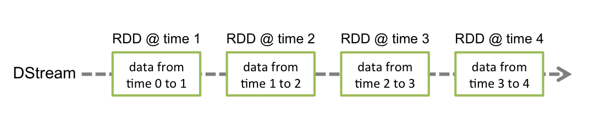

早在2013年，Spark 的流处理组件 Spark Streaming就发布了，之后经过几年迭代，Spark Streaming已经非常成熟了，在业界应用十分广泛。

### Spark Streaming原理

Spark Streaming 原理类似于微积分的思想

微分就是无限细分，积分就是对无限细分的每一段进行求和

流处理的数据时一些列连续不断变化，且无边界的。无法预测下一秒数据是什么样的。Spark Streaming用时间片拆分了无限的数据流，然后对每一个数据片用类似于批处理的方法进行处理，输出的数据也是一块一块的，从这段话的描述中可以看出,Spark Streaming其实并不是真正的实时,它是使用微批的方式处理流数据。


Spark Streaming提供一个对于流数据的抽象模型 **DStream**

DStream底层是由很多个序列化的RDD构成，按照时间段,切分成的每个数据单位都是一个RDD，然后Spark Engine将对DStream的Transformation操作变为针对Spark中针对RDD的Transformation操作。之前的DataFrame和DataSet也同样是基于RDD的，所以RDD是Spark最核心，最基础的数据抽象。


### DStream

下图就是DStream的内部形式，它就是一个连续的RDD序列，每一个RDD代表一个时间片段的输入数据流。



对DStream做转换操作，就等同于对他包含的买一个RDD做同样的转换操作。比如下面的例子

```scala
def main(args: Array[String]): Unit = {
  val sparkConf = new SparkConf().setMaster("local[2]").setAppName("firstApp")
  val ssc = new StreamingContext(sparkConf, Seconds(10)）
  val lines = ssc.socketTextStream("hadoop000", 8888)
  val result = lines.flatMap(_.split(","))
  result.print 
                                 
  ssc.start()
  ssc.awaitTermination()
}
```

首先创建一个lines的DStream,时间片段是10秒，去监听hadoop000的8888端口,每一


